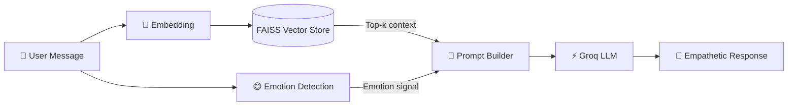
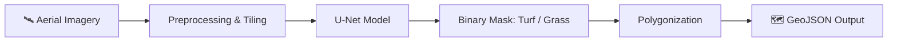

<!-- ===================== HEADER ===================== -->
<div align="center">


<a href="https://git.io/typing-svg">
  
</a>

<br/>


</div>

---

## 👩‍💻 About Me

```python
class Satakshi:
    def __init__(self):
        self.role        = "AI/ML Engineer & Full-Stack Developer"
        self.focus       = ["Generative AI & RAG", "Computer Vision", "MERN Stack"]
        self.currently   = "Building LLM-powered apps and geospatial vision pipelines"
        self.learning    = ["MLOps", "System Design", "Agentic AI"]
        self.fun_fact    = "I debug with print statements and I'm not ashamed 😄"

    def say_hi(self):
        return "Let's build something intelligent together 🚀"
```

- 🧠 I build **end-to-end AI systems**: from data and model training to deployment and UI
- 🌍 Worked on **geospatial deep learning** with GIS-compatible outputs
- 💬 Interested in **AI for mental health & well-being**
- 🌐 Comfortable shipping **full-stack products** with role-based auth, dashboards and REST APIs

---

## 🛠️ Tech Arsenal

<div align="center">

### 🤖 AI / ML & Data


### 🌐 Full-Stack


### ⚙️ Tools & Platforms


</div>

---

## 🚀 Featured Projects

<table>
  <tr>
    <td width="50%" valign="top">

### 🧠 [MindBridge](https://github.com/satakshisingh1610/MindBridge)
**AI-powered mental health chatbot**

Emotion detection + a Retrieval-Augmented Generation pipeline that grounds LLM responses in a vector knowledge base.


    </td>
    <td width="50%" valign="top">

### 🛰️ [Ottermap Vision Challenge](https://github.com/satakshisingh1610/ottermap-open-vision-challenge-Satakshi-Singh)
**Aerial imagery semantic segmentation**

End-to-end **U-Net** pipeline that extracts Turf/Grass regions from aerial images and exports **GIS-compatible GeoJSON**.


    </td>
  </tr>
  <tr>
    <td width="50%" valign="top">

### 💼 [Hireflow](https://github.com/satakshisingh1610/Hireflow)
**Production-ready MERN job portal**

Role-based auth, job posting, applications with resume upload, saved jobs, and separate dashboards for seekers and recruiters.


    </td>
    <td width="50%" valign="top">

### 📉 [Academic Burnout Early Warning System](https://github.com/satakshisingh1610/Academic-Burnout-Early-Warning-System)
**Predictive analytics for student well-being**

Data-driven notebook pipeline that flags early signs of academic burnout so intervention can happen sooner.


    </td>
  </tr>
  <tr>
    <td width="50%" valign="top">

### 🛍️ [Shopify Store Platform](https://github.com/satakshisingh1610/Shopify)
High-performance, responsive, conversion-focused eCommerce design.


    </td>
    <td width="50%" valign="top">

### 💬 [SOCIAL](https://github.com/satakshisingh1610/SOCIAL)
Sleek, responsive social media UI built with React and Tailwind.


    </td>
  </tr>
</table>

---

## 🏗️ How MindBridge Works (RAG Architecture)



## 🛰️ Segmentation Pipeline (Ottermap Challenge)



---

## 📊 GitHub Analytics

<div align="center">


<br/>


<br/>


</div>

---

## 🏆 Trophies

<div align="center">
  
</div>

---

## 🐍 Contribution Snake

<div align="center">
  
</div>

> ⚙️ *Requires the workflow in the setup notes (optional). Delete this section if you skip it.*

---

## 🎯 Currently Working Toward

| 🎯 Goal | 📈 Status |
|---|---|
| Advanced RAG (hybrid search, re-ranking) |  |
| Deploying ML models as scalable APIs |  |
| Agentic AI workflows |  |
| Open-source contributions |  |

---

## 🤝 Let's Connect

<div align="center">

[](https://www.linkedin.com/in/YOUR-LINKEDIN-ID)
[](mailto:YOUR-EMAIL@gmail.com)
[](https://YOUR-PORTFOLIO-LINK)
[](https://x.com/YOUR-HANDLE)

<br/>

⭐ *If you like my work, consider starring a repo, it means a lot!* ⭐


</div>
