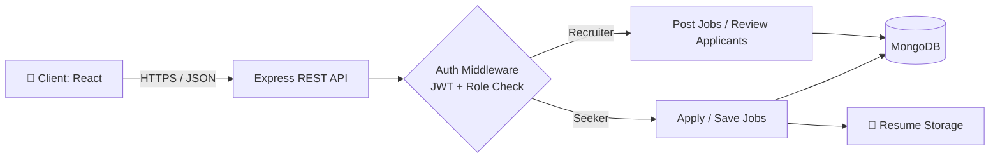
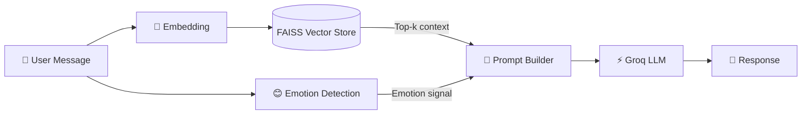

<!-- ===================== HEADER ===================== -->
<div align="center">


<a href="https://git.io/typing-svg">
  
</a>

<br/>


</div>

---

## 👩‍💻 About Me

```typescript
const satakshi = {
  role: "Software Developer",
  focus: ["Full-Stack Web (MERN)", "Backend & REST APIs", "AI-integrated applications"],
  strengths: ["Clean architecture", "Auth & role-based access", "Database design", "Problem solving"],
  currentlyBuilding: "Production-grade apps that combine solid engineering with AI",
  learning: ["System Design", "Docker & CI/CD", "Testing & Observability"],
  motto: "Make it work, make it right, make it fast.",
};
```

I'm a software developer who enjoys the whole lifecycle of a product: designing the data model, building the API, crafting the UI and shipping it. I also bring **AI/ML** into real applications, from RAG chatbots to computer vision pipelines.

---

## 🧰 Skills

<div align="center">

### 💻 Languages


### 🎨 Frontend


### ⚙️ Backend & Databases


### 🤖 AI / Data


### 🛠️ Tools & DevOps


</div>

### 📚 Computer Science Fundamentals

| Area | Topics |
|---|---|
| **Data Structures & Algorithms** | Arrays, Linked Lists, Stacks, Queues, Trees, Graphs, Hashing, Recursion, DP, Sorting & Searching |
| **OOP & Design** | Encapsulation, Inheritance, Polymorphism, SOLID, MVC, REST design |
| **DBMS** | Normalization, Indexing, Joins, Transactions, Schema design (SQL and NoSQL) |
| **Operating Systems** | Processes, Threads, Scheduling, Memory Management, Deadlocks |
| **Computer Networks** | HTTP/HTTPS, TCP/IP, DNS, REST, WebSockets basics |

---

## 🚀 Featured Projects

<table>
  <tr>
    <td width="50%" valign="top">

### 💼 [Hireflow](https://github.com/satakshisingh1610/Hireflow)
**Production-ready MERN job portal**

- 🔐 Role-based authentication (Job Seeker / Recruiter)
- 📝 Job posting, applications and resume upload
- 🔖 Saved jobs and separate dashboards per role
- 🧱 REST API with a modular backend structure


    </td>
    <td width="50%" valign="top">

### 🧠 [MindBridge](https://github.com/satakshisingh1610/MindBridge)
**AI mental health chatbot**

- 😊 Emotion detection on user messages
- 🔎 RAG pipeline with FAISS vector search
- ⚡ Fast LLM inference via Groq
- 💬 Context-aware, empathetic responses


    </td>
  </tr>
  <tr>
    <td width="50%" valign="top">

### 🛰️ [Ottermap Vision Challenge](https://github.com/satakshisingh1610/ottermap-open-vision-challenge-Satakshi-Singh)
**Aerial imagery segmentation pipeline**

- 🧩 End-to-end U-Net semantic segmentation
- 🌿 Extracts Turf/Grass regions from aerial images
- 🗺️ Exports GIS-compatible GeoJSON


    </td>
    <td width="50%" valign="top">

### 📉 [Academic Burnout Early Warning System](https://github.com/satakshisingh1610/Academic-Burnout-Early-Warning-System)
**Predictive analytics for student well-being**

- 📊 Data analysis and feature engineering
- 🚨 Flags early signs of burnout


    </td>
  </tr>
  <tr>
    <td width="50%" valign="top">

### 🛍️ [Shopify Store Platform](https://github.com/satakshisingh1610/Shopify)
High-performance, responsive, conversion-focused eCommerce design.


    </td>
    <td width="50%" valign="top">

### 💬 [SOCIAL](https://github.com/satakshisingh1610/SOCIAL)
Responsive social media UI with clean component architecture.


    </td>
  </tr>
</table>

---

## 🏗️ System Design Snapshots

### Hireflow: Request Flow (MERN)



### MindBridge: RAG Pipeline



---

## 💡 What I Bring to a Team

| | |
|---|---|
| 🧱 **Clean, maintainable code** | Modular structure, meaningful naming, separation of concerns |
| 🔐 **Secure by default** | Authentication, authorization and input validation |
| 🔌 **API design** | Clear REST endpoints, consistent responses, error handling |
| 🗄️ **Data modeling** | Well-structured schemas for both SQL and NoSQL |
| 🤖 **AI integration** | Adding LLM and ML features to real products |
| 🧪 **Ownership** | From idea to working, deployed feature |

---

## 📊 GitHub Analytics

<div align="center">


<br/>


<br/>


</div>

---

## 🐍 Contribution Snake

<div align="center">
  
</div>

---

## 🎯 Currently Levelling Up

| 🎯 Goal | 📈 Status |
|---|---|
| System Design (scalability, caching, load balancing) |  |
| Docker and CI/CD pipelines |  |
| Unit and integration testing |  |
| Data Structures & Algorithms practice |  |

---

## 🤝 Let's Connect

<div align="center">

[](https://www.linkedin.com/in/YOUR-LINKEDIN-ID)
[](mailto:YOUR-EMAIL@gmail.com)
[](https://YOUR-PORTFOLIO-LINK)

<br/>

💬 *Open to internships, full-time roles and collaborations. Let's build something great.*


</div>
