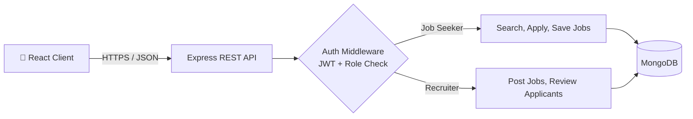
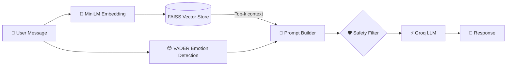

<div align="center">


<a href="https://satakshisingh10.netlify.app/">
  
</a>

<br/>


<br/>

[](https://satakshisingh10.netlify.app/)
[](https://www.linkedin.com/in/satakshi-singh-321766320)
[](mailto:satakshi.568@gmail.com)
[](https://drive.google.com/file/d/1nMoYErQXb8CGtjOfTVtQkV3iNRUbu7ep/view)
[](https://leetcode.com/u/Satakshi568/)

</div>

---

## 👩‍💻 About Me

> 🚀 **Full-Stack Developer & AI/ML Engineer** who ships production-grade MERN apps and builds intelligent systems with **RAG pipelines and LLMs**. **IEEE-published** researcher and **CSE undergraduate at IILM University**.

```typescript
const satakshi = {
  role: "Full-Stack Developer | AI/ML Engineer",
  experience: "Full Stack Intern @ SGCA Technologies",
  education: "B.Tech CSE, IILM University (AI/ML & Data Science)",
  strengths: ["React + Node + Express", "REST APIs & JWT Auth", "RAG & LLM Integration", "DSA & Problem Solving"],
  published: "IEEE 2025: Hybrid CNN for Deepfake Detection (F1 = 0.9)",
  leetcode: "350+ problems solved",
  lookingFor: "Full-time roles & internships",
};
```

<div align="center">

| 🏢 Internships | 📄 IEEE Paper | 🧩 LeetCode | 🚀 Projects |
|:---:|:---:|:---:|:---:|
| **2** | **1st Author** | **350+** | **5+ shipped** |

</div>

---

## 💼 Experience

| | |
|---|---|
| 🏢 **Full Stack Developer Intern**<br/>SGCA Technologies, Noida<br/>`Nov 2025 – Feb 2026` | ⚡ Built responsive, scalable **React.js** UIs integrated with **Node/Express REST APIs**, improving page load performance by **~30%**<br/>🔀 Worked in **Agile** with Git feature branching and pull-request reviews<br/>🧪 Wrote unit and integration tests and took part in code reviews, reducing post-deployment bugs |
| 🏢 **Full Stack Web Developer Intern**<br/>CodeAlpha<br/>`Jun 2024 – Jul 2024` | 🧱 Designed modular, reusable **React** components that improved UI consistency<br/>🔌 Connected frontend to backend services for end-to-end data flow and fixed render bottlenecks |

---

## 🧰 Tech Stack

<div align="center">

### 💻 Languages


### 🎨 Frontend


### ⚙️ Backend & Databases


### 🤖 AI / ML


### 🛠️ Tools & Deployment


</div>

**📚 CS Core:** `Data Structures & Algorithms` · `OOP` · `System Design` · `Time & Space Complexity` · `DBMS` · `REST API Design`

---

## 🚀 Featured Projects

<table>
  <tr>
    <td width="50%" valign="top">

### 💼 [HireFlow](https://github.com/satakshisingh1610/Hireflow)
**Full-stack MERN job portal** ⭐ *Featured*

- 🔐 Role-based auth with **JWT refresh tokens** and encrypted passwords
- ⚡ **<200ms** API response times
- 🗄️ Normalized MongoDB schemas, job search, filters and application tracking
- 🌍 Deployed on **Vercel + Render**, fixed CORS and env issues in production


    </td>
    <td width="50%" valign="top">

### 🧠 [MindBridge](https://github.com/satakshisingh1610/MindBridge)
**AI mental health companion** ⭐ *Featured*

- 🔎 **RAG pipeline**: FAISS + MiniLM sentence-transformer embeddings
- 😊 Emotion-aware responses with **VADER**
- 🛡️ Multi-level safety filtering and crisis detection
- 🌐 Multilingual support, mood tracking and journaling, with a Gradio UI


    </td>
  </tr>
  <tr>
    <td width="50%" valign="top">

### 🛰️ [Ottermap Vision Challenge](https://github.com/satakshisingh1610/ottermap-open-vision-challenge-Satakshi-Singh)
**Aerial imagery segmentation**

- 🧩 End-to-end **U-Net** pipeline to extract Turf/Grass regions
- 🗺️ Exports **GIS-compatible GeoJSON**


    </td>
    <td width="50%" valign="top">

### 📉 [Academic Burnout Early Warning System](https://github.com/satakshisingh1610/Academic-Burnout-Early-Warning-System)
**Predictive analytics for students**

- 📊 Data analysis and ML to flag early signs of burnout


    </td>
  </tr>
  <tr>
    <td width="50%" valign="top">

### 🛍️ [Shopify Store Platform](https://github.com/satakshisingh1610/Shopify)
Conversion-focused, fully responsive eCommerce UI in TypeScript.


    </td>
    <td width="50%" valign="top">

### 💬 [SOCIAL](https://github.com/satakshisingh1610/SOCIAL)
Sleek social media UI with modular React architecture.


    </td>
  </tr>
</table>

---

## 🏗️ System Design Snapshots

**HireFlow: request flow**



**MindBridge: RAG pipeline**



---

## 📄 Research Publication

> 🏆 **Performance Optimization of Deepfake Video Detection Using Hybrid CNN Framework**
> *IEEE Conference, 2025 · First Author*
> Proposed a hybrid **Xception + InceptionResNetV2** framework reaching an **F1-score of 0.9** on the **DFDC** dataset through enhanced feature extraction.

---

## 🏅 Achievements & Leadership

| | |
|---|---|
| 🧩 **LeetCode** | Solved **350+** problems with consistent DSA practice |
| 👑 **President** | Data Science & Big Data Analysis Club, IILM University: led workshops and mentored peers in ML |
| 🔥 **IGNITE Coordinator** | Organized IILM's flagship tech and innovation fest (April 2025) |
| 🎓 **Certifications** | Data Science Bootcamp (GeeksforGeeks) · Mastering Generative AI & ChatGPT (GeeksforGeeks) · Full Stack Web Development (CodeAlpha) · Python, Java & C (Infosys Springboard / DataFlair) |

---

## 📊 GitHub Analytics

<div align="center">


<br/>


<br/>


</div>

---

## 🎯 Currently Levelling Up

| 🎯 Goal | 📈 Status |
|---|---|
| System Design (scalability, caching, load balancing) |  |
| Advanced RAG and LLM applications |  |
| CI/CD with GitHub Actions |  |
| DSA and competitive problem solving |  |

---

<div align="center">

### 🤝 Let's build something great together

[](mailto:satakshi.568@gmail.com)
[](https://www.linkedin.com/in/satakshi-singh-321766320)
[](https://satakshisingh10.netlify.app/)

⭐ *If you like my work, drop a star on a repo!* ⭐


</div>
